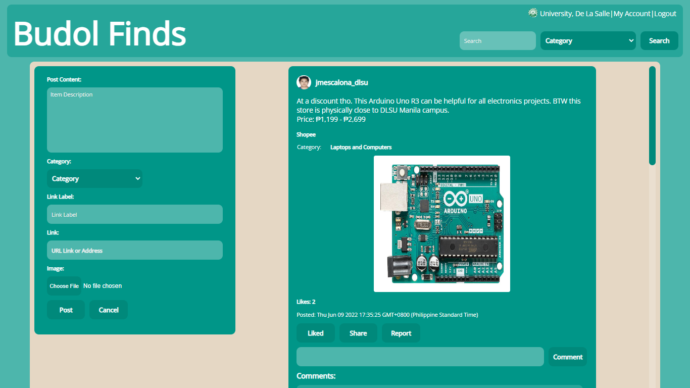

# CCAPDEV-MCO

## Description
The machine project for this course is to make a web application of your choice based on the specification required.

## Specifications
The web application must have the capabilities of a CRUDS application.
### Features required for all web applications:
1. Log-in and Log-out
2. Register
### CRUDS (Simplified)
1. Create - Create web content
2. Read - Read web content
3. Update - Update web content
4. Delete - Delete web content
5. Search - Search web content
### Web App Description
The web application was inspired by a private Facebook group called Home Buddies, which at the time of the web app's creation has over 3 million members. The Facebook group’s posts cover
different topics and purposes, however, the group decided to take on the idea of
sharing “budol finds”, which are items that were bought and enjoyed by home
shoppers. The web application’s main aim is to provide a platform of consolidated
“budol finds” for shoppers to make sharing and finding items easier, rather than a
general Facebook group page. Through the web application, shoppers are given a
better shopping experience as items they wish to buy are items suggested by fellow
shoppers. It also makes it easier to shop as items are organized by categories and
provided with a link or destination on where it can be bought.
The web application would require a user to create an account before they are
able to share their finds. The user can then create a post containing what they bought,
where to find it, and a media attachment of the item. The website would have a user
page, home page/timeline, and different pages organized by item category (e.g.:
‘Women’s Clothing’, ‘Men’s Clothing’, ‘Home’, ‘Pet Supplies’, etc.).

## Installation (Only if hosted via localhost)
* Automated Prerequisite: Clone the git repo and locate `/Official`.
    * Automated (Full Data Install) - Run `run_install_full.bat` to automatically build the database (collection and contents) and install the npm modules needed for by the web and server application.
    * Automated (Minimal Data Install) - Run `run_install_minimal.bat` to automatically build the database (collections only) and install the npm modules needed for by the web and server application.
* Manual Installation Prerequisite: Execute `npm install`
    * Manual (Full Data) - On Command Prompt enter: `node install_data.js`
    * Manual (Minimal Data) - On Command Prompt enter: `node install_onlycollections.js`

## Execution
1. Normal Mode: Run `node app.js` or `npm start`, or Open `run_app.bat`
2. Dev Mode: Run `npx nodemon app.js` or `npm run devmode`, or Open `run_dev.bat`

## Demonstration Credentials
Please refer to the [documentation's](https://github.com/jm55DLSU/CCAPDEV-MCO/blob/main/Documentation/MCO%20Documentation%20-%20PDF.pdf) **Demonstration User Credentials** segment at the last page.

## Technologies used:
* Frontend
    * Vanilla JS
    * JQuery (via Cloudflare CDN)
    * Express-Handlebars
* Backend
    * NodeJS (v16.15.0)
    * Express
    * MongoDB (v5.0.3)
    * MongoDB Atlas
    * NPM (v8.11.0)
* Dependencies (Extracted from package.json)
    * bcrypt
    * cookier-parser
    * crypto-random-string
    * dotenv
    * express
    * express-handlebars
    * express-session
    * hashids
    * https-status-codes
    * mongodb
    * multer
    * nocache
    * path
    * server-favicon
    * url
* External Dependencies
    * validator.js (via unpkg.com)

### [More Documentation](https://github.com/jm55DLSU/CCAPDEV-MCO/blob/main/Documentation/MCO%20Documentation%20-%20PDF.pdf)
